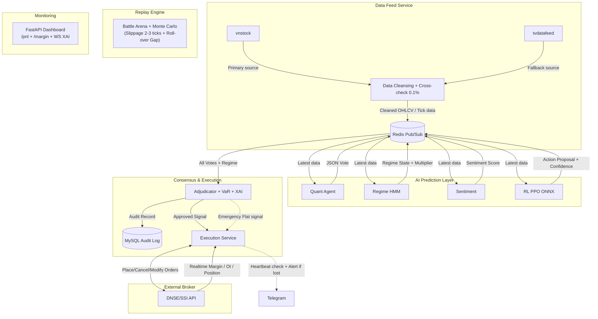

```mermaid
graph TD
    subgraph "Data Feed Service"
        V[vnstock] -->|"Primary source"| DC["Data Cleansing + Cross-check 0.1%"]
        T[tvdatafeed] -->|"Fallback source"| DC
        DC -->|"Cleaned OHLCV / Tick data"| Redis[(Redis Pub/Sub)]
    end

    subgraph "AI Prediction Layer"
        Redis -->|"Latest data"| QA[Quant Agent]
        Redis -->|"Latest data"| HMM["Regime HMM"]
        Redis -->|"Latest data"| SA[Sentiment]
        Redis -->|"Latest data"| RL["RL PPO ONNX"]
        
        QA -->|"JSON Vote"| Redis
        HMM -->|"Regime State + Multiplier"| Redis
        SA -->|"Sentiment Score"| Redis
        RL -->|"Action Proposal + Confidence"| Redis
    end

    subgraph "Consensus & Execution"
        Redis -->|"All Votes + Regime"| ADJ["Adjudicator + VaR + XAI"]
        ADJ -->|"Audit Record"| DB[(MySQL Audit Log)]
        ADJ -->|"Approved Signal"| EXEC[Execution Service]
    end

    subgraph "Replay Engine"
        RE["Battle Arena + Monte Carlo<br>(Slippage 2-3 ticks + Roll-over Gap)"]
    end

    subgraph "Monitoring"
        DASH["FastAPI Dashboard<br>/pnl + /margin + WS XAI"]
    end

    subgraph "External Broker"
        EXEC <-->|"Place/Cancel/Modify Orders"| Broker["DNSE/SSI API"]
        Broker -->|"Realtime Margin / OI / Position"| EXEC
    end

    %% Fail-safe connections
    EXEC -.->|"Heartbeat check + Alert if lost"| TG[Telegram]
    ADJ -.->|"Emergency Flat signal"| EXEC
```
