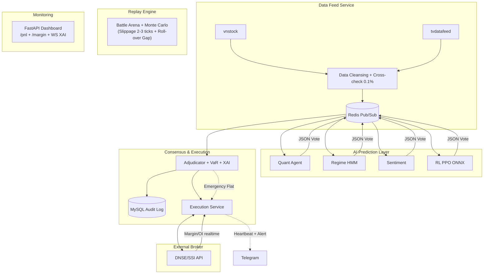

```mermaid
graph TD
    subgraph "Data Feed Service"
        V[vnstock] --> DC[Data Cleansing + Cross-check 0.1%]
        T[tvdatafeed] --> DC
        DC --> Redis[(Redis Pub/Sub)]
    end

    subgraph "AI Prediction Layer"
        Redis --> QA[Quant Agent]
        Redis --> HMM[Regime HMM]
        Redis --> SA[Sentiment]
        Redis --> RL[RL PPO ONNX]
        QA & HMM & SA & RL -->|JSON Vote| Redis
    end

    subgraph "Consensus & Execution"
        Redis --> ADJ[Adjudicator + VaR + XAI]
        ADJ --> DB[(MySQL Audit Log)]
        ADJ --> EXEC[Execution Service]
    end

    subgraph "Replay Engine"
        RE["Battle Arena + Monte Carlo<br>(Slippage 2-3 ticks + Roll-over Gap)"]
    end

    subgraph "Monitoring"
        DASH["FastAPI Dashboard<br>/pnl + /margin + WS XAI"]
    end

    subgraph "External Broker"
        EXEC <--> Broker[DNSE/SSI API]
        Broker -->|Margin/OI realtime| EXEC
    end

    %% Fail-safe
    EXEC -.->|Heartbeat + Alert| TG[Telegram]
    ADJ -.->|Emergency Flat| EXEC
```
