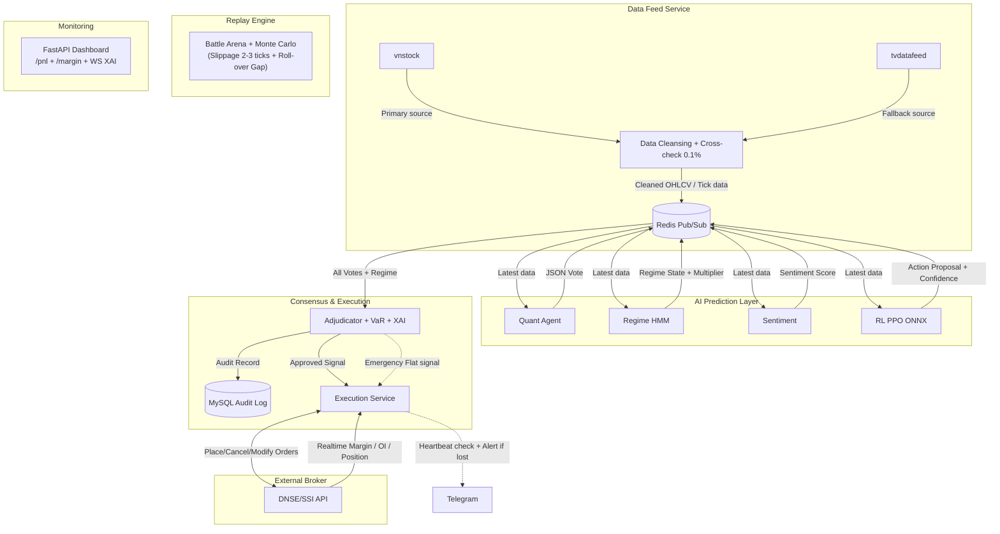

# TÀI LIỆU ĐẶC TẢ HỆ THỐNG CHI TIẾT (SRS & SDD)  
**DỰ ÁN AI TRADING ĐA TÁC VỤ (VN30F1M MVP)**

**Kiến trúc Production-Ready, Risk-Aware AI & Fail-Safe Design**  
Ngày 22 tháng 3 năm 2026

## Mục lục
- [1. TỔNG QUAN DỰ ÁN & KIẾN TRÚC MỨC CAO](#1-tổng-quan-dự-án--kiến-trúc-mức-cao)
- [2. LỘ TRÌNH PHÁT TRIỂN 6 THÁNG (ROADMAP)](#2-lộ-trình-phát-triển-6-tháng-roadmap)
- [3. KIẾN TRÚC MICROSERVICES & TECH STACK](#3-kiến-trúc-microservices--tech-stack)
- [4. HỆ THỐNG AN TOÀN & DỰ PHÒNG (FAIL-SAFE DESIGN)](#4-hệ-thống-an-toàn--dự-phòng-fail-safe-design)
- [5. YÊU CẦU HỆ THỐNG (SYSTEM REQUIREMENTS)](#5-yêu-cầu-hệ-thống-system-requirements)
- [6. THIẾT KẾ CÁC TÁC NHÂN LÕI (CORE AGENTS DESIGN)](#6-thiết-kế-các-tác-nhân-lõi-core-agents-design)

---

## 1. TỔNG QUAN DỰ ÁN & KIẾN TRÚC MỨC CAO

### 1.1 Mục tiêu Hệ thống
Xây dựng hệ thống giao dịch thuật toán tự động hoàn toàn cho hợp đồng tương lai VN30F1M.  
**Điểm độc bản (USP)**: Tích hợp Risk-Aware Multi-Agent với XAI, phân tích chu kỳ thị trường (HMM), và mô hình RL chịu phạt khi bị Phủ quyết (Veto).

### 1.2 Kiến trúc C4 Model - Cấp độ Container (Monorepo Tối ưu Độ trễ)
Để đảm bảo latency < 200ms trong Phase 1-2, hệ thống triển khai theo dạng **Monorepo**, giao tiếp nội bộ qua **Redis Pub/Sub**:

- **Data Ingestion Layer**: `vnstock` (Primary) + `tvdatafeed` (Fallback). Cross-check 0.1%.
- **Prediction Layer**: Các Agents đọc data qua Redis Pub/Sub → Inference bằng mô hình ONNX → Sinh JSON Vote đẩy lại Redis.
- **Consensus Layer (Adjudicator)**: Tổng hợp Votes → Đánh giá VaR → Quyết định (Hold/Veto/Execute).
- **Execution Layer**: Tiếp nhận quyết định, ghi log lệnh (Paper-trade) hoặc gọi API Broker (DNSE/SSI).

**Hình 1.1: Kiến trúc hệ thống AI Trading**



---

## 2. LỘ TRÌNH PHÁT TRIỂN 6 THÁNG (ROADMAP)

### 2.1 Tháng 1–2 (Phase 1: Nền tảng & Môi trường giả lập)
- Triển khai Data Feed Svc (`vnstock` + `tvdatafeed` fallback + Redis cache).
- Xây dựng Replay Engine & Battle Arena (chạy 5 phiên bản Adjudicator song song).
- Cảnh báo tự động nếu chênh lệch 2 nguồn dữ liệu > 0.1%.

### 2.2 Tháng 3–4 (Phase 2 & 3: Lõi AI & Cơ chế Đồng thuận)
- Triển khai Quant Agent và Market Regime Agent (HMM).
- Sentiment Agent: Sử dụng RSS Cafef/Vietstock + Newspaper3k kết hợp Proxy Rotation (tránh block IP).
- Hoàn thiện Adjudicator với XAI JSON và Dynamic Weighting (Kalman Filter).
- Smart Position Sizing & Auto Roll-over (đóng vị thế vào 14:00 ngày trước thứ 5 tuần 3).

### 2.3 Tháng 5–6 (Phase 4: Tích hợp RL & Triển khai Production)
- Huấn luyện Hybrid RL PPO (Sử dụng Ray RLlib/Stable-Baselines3, export sang ONNX).
- Triển khai Execution Svc (Kết nối Python-fctrading/Broker API) để live paper-trade.
- Xây dựng Streamlit/Grafana Dashboard giám sát PnL thời gian thực.

---

## 3. KIẾN TRÚC MICROSERVICES & TECH STACK

| Service          | Chức năng Core                                      | Tech Stack                  |
|------------------|-----------------------------------------------------|-----------------------------|
| Data Feed        | Kéo data, cross-check, cache dữ liệu nhịp cao       | FastAPI, vnstock, Redis     |
| Replay Env       | Battle Arena, Walk-forward & Monte Carlo stress test| Python OOP                  |
| Quant/Regime     | Chạy HMM, tính toán TA                              | Scikit-learn, ONNX          |
| Sentiment        | Crawl RSS/Newspaper3k + Proxy, gán Sentiment        | Claude API/Newspaper3k      |
| RL Agent         | PPO Inference                                       | PyTorch → ONNX              |
| Adjudicator      | Đọc Votes, tính VaR, Dynamic Weights, xuất XAI JSON | FastAPI, MySQL              |
| Execution        | Đặt lệnh thực tế, quản lý kết nối Broker (DNSE/SSI) | python-fctrading            |
| Dashboard        | Cung cấp API giám sát và Websocket XAI              | FastAPI, Uvicorn            |

### 3.1 Dashboard & Monitoring Endpoints (FastAPI)
Hệ thống cung cấp các endpoint phục vụ giám sát thời gian thực:
- `WS /ws/v1/adjudicator/xai`: WebSocket đẩy log XAI JSON realtime ngay khi Adjudicator ra quyết định.
- `GET /api/v1/execution/margin`: Endpoint theo dõi tỷ lệ ký quỹ.
- `GET /api/v1/dashboard/pnl`: Trả về snapshot trạng thái hệ thống và mảng Time-series PnL.

**Đặc tả Response JSON cho Dashboard PnL:**

```json
{
  "timestamp": "2026-03-22T14:30:00Z",
  "symbol": "VN30F1M",
  "session_summary": {
    "total_trades": 12,
    "win_rate": 0.65,
    "pnl_points": 15.5,
    "pnl_vnd": 1550000,
    "max_drawdown_percent": 1.2,
    "margin_ratio_current": 0.92
  },
  "active_position": {
    "type": "LONG",
    "volume": 5,
    "entry_price": 1250.5,
    "current_price": 1252.0,
    "unrealized_pnl": 7.5
  },
  "timeseries_data": [
    {"time": "14:25", "pnl": 12.0, "regime": "Trending Up"},
    {"time": "14:30", "pnl": 15.5, "regime": "Trending Up"}
  ]
}
```

---

## 4. HỆ THỐNG AN TOÀN & DỰ PHÒNG (FAIL-SAFE DESIGN)
Hệ thống phải duy trì trạng thái **Graceful Degradation** (Suy giảm nhẹ nhàng) thay vì sập hoàn toàn khi có sự cố:

- **C1 - Data Source Down**: Mất kết nối API sàn > 30s → Tự động chuyển toàn bộ hệ thống sang trạng thái HOLD, gửi Alert Telegram.
- **C2 - Broker Disconnect**: Heartbeat check mỗi 5s thất bại → Kích hoạt Emergency Flat (Close toàn bộ lệnh ngay lập tức khi kết nối lại).
- **C3 - Adjudicator Crash**: Fallback sang Rule-based đơn giản (Chỉ nghe theo Quant Agent + Hard stop-loss 1%).
- **C4 - Extreme Volatility**: Nếu Regime Agent phát hiện "Black Swan" → Bắt buộc giảm Position 80% và tăng chặt Threshold VaR.
- **C5 - Security**: API Key Rotation định kỳ, 2FA qua TOTP nội bộ, áp dụng Position Limit cứng ở mức an toàn.

### 4.1 Bảo vệ Ký quỹ & Kịch bản Kiểm thử (Margin & Coverage)
- **C6 - Margin Call Prevention (Forced Liquidation)**: Execution Service liên tục quét `Account Margin Ratio` từ Broker. Nếu tỷ lệ giảm xuống dưới 85% (tiệm cận ngưỡng Call), hệ thống tự động kích hoạt lệnh Market (MP) để hạ vị thế từng phần (Scale-out) trước khi bị ép bán giải chấp.
- **Kịch bản Slippage (Trượt giá)**: Trong Monte Carlo Test, mọi lệnh đều bị cộng thêm độ trượt giá ngẫu nhiên **2-3 ticks** (0.2 – 0.3 điểm).

```python
# Listing 4.1: Mô phỏng trượt giá trong Replay Engine
tick_size = 0.1  # Bước giá VN30F1M
slippage_ticks = random.randint(2, 3)
if action == "LONG":
    executed_price = current_market_price + (slippage_ticks * tick_size)
elif action == "SHORT":
    executed_price = current_market_price - (slippage_ticks * tick_size)
```

- **Kịch bản Roll-over Gap**: Replay Engine tự động tiêm (inject) nhiễu Gap **10-15 điểm** vào phiên ATO ngày Thứ Sáu (sau thứ Năm tuần thứ 3) để stress-test Drawdown.

---

## 5. YÊU CẦU HỆ THỐNG (SYSTEM REQUIREMENTS)

### 5.1 Yêu cầu Chức năng (FR)
- **FR1 - Dynamic Weighting**: Trọng số Vote không cố định, thay đổi theo hiệu suất quá khứ bằng thuật toán cập nhật Bayesian/Kalman.
- **FR2 - Smart Position Sizing**: Kích thước lệnh điều chỉnh động dựa trên Open Interest (OI), tỷ lệ Margin và cảnh báo từ Market Regime Agent (VD: Volatile thì giảm 50% vị thế).
- **FR3 - Auto Roll-over**: Tự động đóng F1M và mở F2M trước thứ 5 tuần thứ 3 của tháng.

### 5.2 Yêu cầu Phi chức năng (NFR)
- **NFR1 - Latency**: Thời gian từ lúc có tick data đến khi Adjudicator ra lệnh < 200ms. Toàn bộ quá trình tính toán 5-phút < 1000ms.
- **NFR2 - Uptime**: 99.99% trong khung giờ 8:45 - 14:45.
- **NFR3 - Security**: API Keys phải được mã hóa (AES-256), Audit log mọi quyết định Veto vào MySQL dưới dạng Append-only để tuân thủ Ủy ban Chứng khoán.

---

## 6. THIẾT KẾ CÁC TÁC NHÂN LÕI (CORE AGENTS DESIGN)

### 6.1 Đặc tả Thuật toán Lõi: VaR & Market Regime HMM
- **Mô hình VaR (Value at Risk)**: Sử dụng phương pháp **Historical Simulation VaR** ở mức độ tin cậy 99% thay vì Parametric VaR, nhằm bắt được các đặc tính "đuôi dày" (fat tails) của VN30F1M. Công thức Parametric tham chiếu:
  $$
  VaR = P \cdot (\mu - z_{\alpha} \cdot \sigma)
  $$

**Chú giải các biến số:**
- $VaR$: Giá trị chịu rủi ro (Value at Risk). Đây là ngưỡng thua lỗ tối đa dự kiến của danh mục đầu tư trong một chu kỳ thời gian nhất định (ví dụ: 5 phút tới) với một mức độ tin cậy xác định trước.
- $P$: Tổng giá trị vị thế (Position Value). Quy mô vốn hiện tại đang nằm trong các hợp đồng tương lai VN30F1M.
- $\mu$: Tỷ suất sinh lời kỳ vọng (Expected Mean Return) của tài sản trong khoảng thời gian lịch sử được phân tích.
- $z_{\alpha}$: Giá trị tới hạn Z (Z-score) từ phân phối chuẩn, tương ứng với mức ý nghĩa $\alpha$ (hay độ tin cậy $1 - \alpha$). Ví dụ: Nếu Adjudicator yêu cầu độ tin cậy 99% (tức $\alpha = 0.01$), thì $z_{0.01} \approx 2.33$.
- $\sigma$: Độ biến động (Volatility) hay độ lệch chuẩn của tỷ suất sinh lời hợp đồng. Khi thị trường rung lắc mạnh, $\sigma$ tăng cao kéo theo $VaR$ tăng, dễ chạm ngưỡng kích hoạt Veto.

**Ngưỡng VaR và Cắt lỗ**: Adjudicator sẽ so sánh VaR hiện tại với VaR Threshold.  
**Ngưỡng VaR mặc định (Base VaR Threshold)** được chốt cứng ở mức **2.0% tổng vốn ký quỹ**. Ngưỡng này sẽ được điều chỉnh động (nới lỏng hoặc bóp nghẹt) dựa trên hệ số phạt của Market Regime Agent theo công thức:
$$
VaR_{threshold\_final} = Base\_Threshold \times Regime\_Multiplier
$$
Ví dụ: Nếu thị trường bước vào trạng thái Volatile (hệ số $Regime\_Multiplier = 0.8$), thì $VaR_{threshold\_final}$ sẽ bị ép xuống còn **1.6%**. Nếu $VaR_{current} > VaR_{threshold\_final}$, lệnh lập tức bị Veto.

- **Market Regime Agent (HMM)**:
  - **Thư viện & Cấu hình**: Sử dụng `hmmlearn.hmm.GaussianHMM` cấu hình với **4 trạng thái tiềm ẩn (Latent States)**: Trending Up, Trending Down, Mean-Reverting, và Volatile (Whipsaw).
  - **Dữ liệu & Tần suất Huấn luyện (Retrain)**: Model **không** học online trong phiên để tránh nhiễu và over-fitting cục bộ. Quá trình Retrain được lập lịch chạy ngầm tự động qua Cronjob vào **đúng 00:00 Chủ Nhật hàng tuần**. Dữ liệu huấn luyện sử dụng Log Returns 5-phút và Garman-Klass Volatility của 6 tháng gần nhất. Sau khi hội tụ, mô hình sẽ được serialize và lưu trữ dưới định dạng `.joblib` (tối ưu hơn `.pickle` khi xử lý các ma trận Numpy lớn của HMM) để load vào memory cho tuần giao dịch mới.

**Dữ liệu huấn luyện HMM**: Sử dụng cửa sổ trượt (rolling window) 5-phút của chuỗi Log Returns và độ biến động Garman-Klass Volatility trong 6 tháng gần nhất.

### 6.2 Hybrid RL Trading Agent
- **Tần suất Suy luận (Inference Frequency)**: RL Agent thực hiện Inference **mỗi 5 phút** (ngay tại thời điểm đóng nến M5). Việc không chạy inference mỗi tick giúp mô hình tránh bị nhiễu vi mô (micro-structure noise) và tối ưu độ trễ tính toán. Tuy nhiên, các điều kiện đóng lệnh khẩn cấp (như VaR breach) vẫn được Adjudicator kiểm tra realtime mỗi giây.
- **Thuật toán**: Proximal Policy Optimization (PPO).
- **State Space**: `[OHLCV, MACD, Regime_Flag, Sentiment_Score, Ensemble_Votes]`.
- **Action Space**: Continuous `[-1, 1]` (Short 100% đến Long 100%).
- **Hàm phần thưởng (Reward Function)**:
  $$
  R_t = PnL_t - Penalty_{fee} - \lambda \cdot I(Veto_{Adjudicator})
  $$
  **Chú giải các biến số**:
  - $R_t$: Phần thưởng (Reward) mà tác nhân Học tăng cường nhận được tại bước thời gian $t$.
  - $PnL_t$: Lợi nhuận hoặc Thua lỗ (Profit and Loss) của vị thế tại thời điểm $t$.
  - $Penalty_{fee}$: Hàm phạt chi phí giao dịch (Transaction Cost Penalty).
  - $\lambda$: Hệ số phạt rủi ro (Risk Penalty Coefficient). Trong cấu hình hệ thống hiện tại, **$\lambda = 2$**.
  - $I(Veto_{Adjudicator})$: Hàm chỉ thị (Indicator Function) của Tác nhân Thẩm định.

(Thưởng PnL dương; Trừ phí giao dịch; Phạt -2 nếu bị Adjudicator Veto để dạy RL "tôn trọng rủi ro").

### 6.3 Adjudicator Agent & XAI Contract
Adjudicator giải thích lý do Phủ quyết (Veto) hoặc Chấp thuận lệnh bằng định dạng JSON minh bạch. Trong đó, ngưỡng VaR Threshold không cố định mà bị siết chặt dựa trên hệ số của Market Regime:

```json
{
  "timestamp": "2026-03-22T10:05:00Z",
  "symbol": "VN30F1M",
  "adjudicator_action": "VETO",
  "final_position": "HOLD",
  "xai_explanation": {
    "reason": "VaR_current (0.025) exceeds VaR_threshold_final (0.016) due to Volatile Regime penalty.",
    "metrics": {
      "var_current": 0.025,
      "var_threshold_base": 0.020,
      "regime_state": "Volatile",
      "regime_penalty_multiplier": 0.8,
      "var_threshold_final": 0.016,
      "sentiment_score": -0.65,
      "quant_confidence": 0.42
    }
  }
}
```

---
